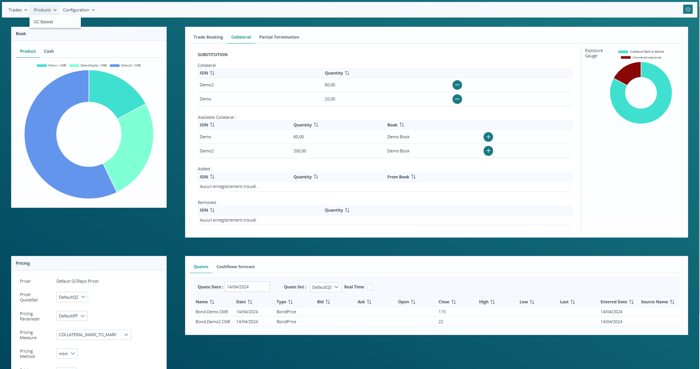

# Tradista: the first open source Post Trading Solution


Tradista is a lightweight Financial Risk Management Solution enabling you to manage in a single tool your daily treasury & risk management tasks. Tradista, among other possibilities, can be used for market data analyses, pre-deal checks and trades booking, P&L management, financial inventory management and reporting.
See more on [tradista.finance](https://www.tradista.finance)



Tradista is a Java based application. The server is based on WildFly and the clients are based on JavaFX and PrimeFaces.

Tested configuration:
- Server: WildFly 18.0.1
- JRE: Oracle JRE v11.0.5 or OpenJDK JRE (RedHat implementation) v11.0.14.9
- Database: Derby 10.15.2.0
- Build automation tool: Maven 3.6.2

Tradista can be built using Maven, build the whole application using the tradista-parent project.
```
maven clean install
```

Thanks for you interest. Ping me anytime for any question.
I am currently working on an installer easing the test of Tradista. Stay tuned !

# Dependencies
Tradista is made possible using powerful third party tools:
- [Apache Commons](https://commons.apache.org/) for Maths, CSV processing and many more
- [Apache Derby](https://db.apache.org/derby/) for the database
- [Apache Maven](https://maven.apache.org/) for the builds
- [Apache POI](https://poi.apache.org/) for Microsoft Excel export
- [ASP4J](https://github.com/hbeck/asp4j) for Answer Set Programming
- [Bloomberg API](https://www.bloomberg.com/professional/support/api-library/) to connect to Bloomberg
- [JavaFX](https://openjfx.io/) for the Desktop client
- [PrimeFaces](https://www.primefaces.org/) for the WEB UI
- [Quandl4J](https://github.com/jimmoores/quandl4j) to connect to Quandl REST API
- [Quartz](http://www.quartz-scheduler.org/) for job scheduling
- [Spring](https://spring.io/) for dependency injection, introspection and many more
- [Tweety](https://tweetyproject.org/) for first order logic processing
- [WildFly](https://www.wildfly.org/) for the server
